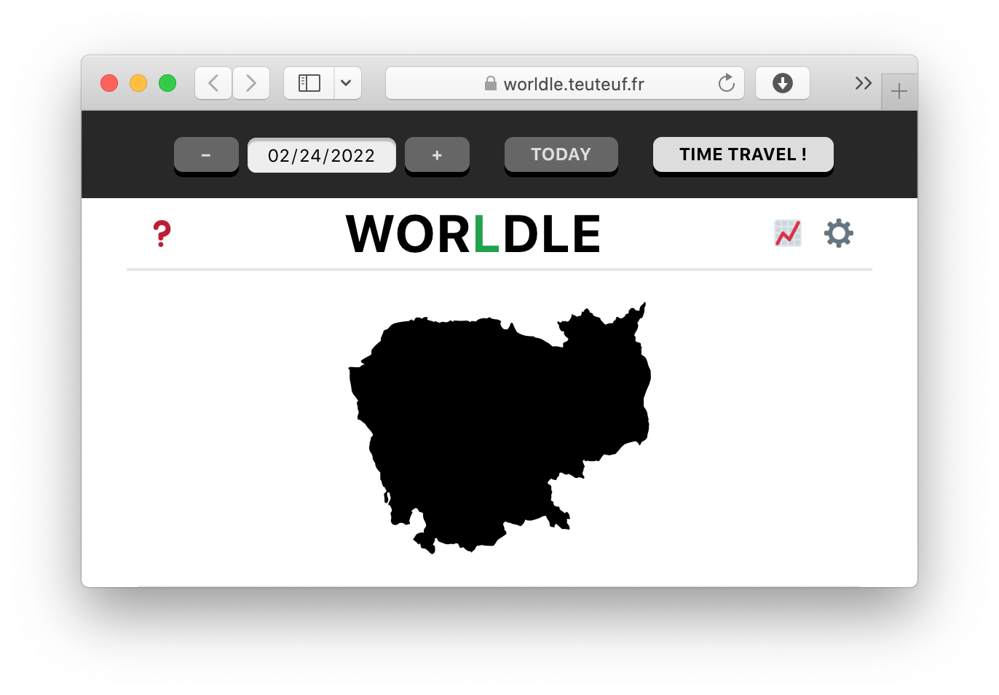

# Worldle Time Machine (Userscript)

Play the [Worldle](https://worldle.teuteuf.fr) puzzle for any day you like, past or future — just set the date in the header and hit *Time Travel !*

Tested in Safari on macOS. ([See below for installation instructions.](#installation-in-safari-on-macos))

Not working on iOS. Not tested in other browsers.

## Installation in Safari on macOS

1. Install [Userscripts Safari](https://github.com/quoid/userscripts) ([App Store](https://apps.apple.com/us/app/userscripts/id1463298887))
2. Open the Userscripts manager
3. Press the +, and then choose "New Remote"
4. Paste in this URL: https://raw.githubusercontent.com/nickloewen/worldle-time-machine/main/worldle-time-machine.js
5. Press save
